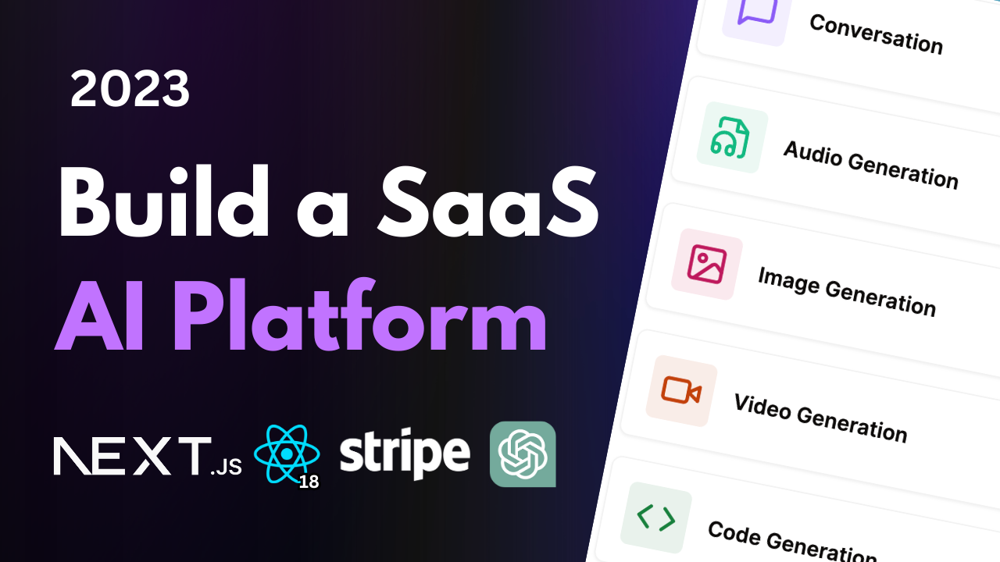

# Build a SaaS AI Platform with Next.js 14, React, Tailwind, Prisma, Stripe

<div align="center">
  
</div>

###
This is a repository for Build a SaaS AI Platform with Next.js 14, React, Tailwind, Prisma, Stripe.

## Tech Stack

- Next.js
- Tailwind CSS
- Shadcn/ui
- Clerk
- Prisma
- Stripe
- Crisp-Chat
- OpenAI
- Zustand

## Features

- Tailwind design
- Tailwind animations and effects
- Full responsiveness
- Clerk Authentication (Email, Google, 9+ Social Logins)
- Client form validation and handling using react-hook-form
- Server error handling using react-toast
- Image Generation Tool (Open AI)
- Video Generation Tool (Replicate AI)
- Conversation Generation Tool (Open AI)
- Music Generation Tool (Replicate AI)
- Page loading state
- Stripe monthly subscription
- Free tier with API limiting
- How to write POST, DELETE, and GET routes in route handlers (app/api)
- How to fetch data in server react components by directly accessing database (WITHOUT API! like Magic!)
- How to handle relations between Server and Child components!
- How to reuse layouts
- Folder structure in Next 14 App Router

### Prerequisites

**Node version 18.x.x**

### Cloning the repository

```shell
https://github.com/zim89/genius-ai-saas.git
```

### Install packages

```shell
npm i
```

### Setup .env file


```js
  NEXT_PUBLIC_CLERK_PUBLISHABLE_KEY= 
  CLERK_SECRET_KEY= 
    
  NEXT_PUBLIC_CLERK_SIGN_IN_URL=/login
  NEXT_PUBLIC_CLERK_SIGN_UP_URL=/register
  NEXT_PUBLIC_CLERK_AFTER_SIGN_IN_URL=/dashboard
  NEXT_PUBLIC_CLERK_AFTER_SIGN_UP_URL=/dashboard

  OPENAI_API_KEY=
  REPLICATE_API_TOKEN=


  DATABASE_URL=
  DIRECT_URL=

  STRIPE_API_KEY=
  STRIPE_WEBHOOK_SECRET=

  NEXT_PUBLIC_APP_URL=
```

### Setup Prisma

Add PostgreSQL Database (I used Neon)

```shell
npx prisma db push

```

### Start the app

```shell
npm run dev
```

